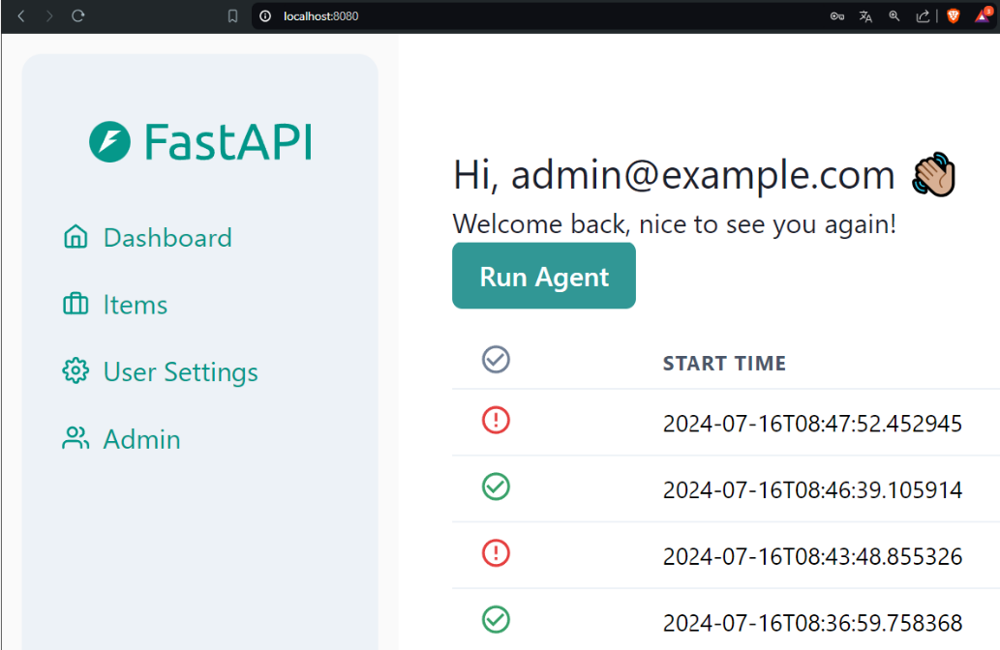
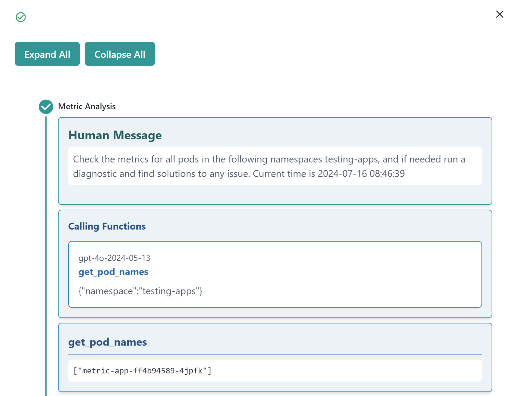
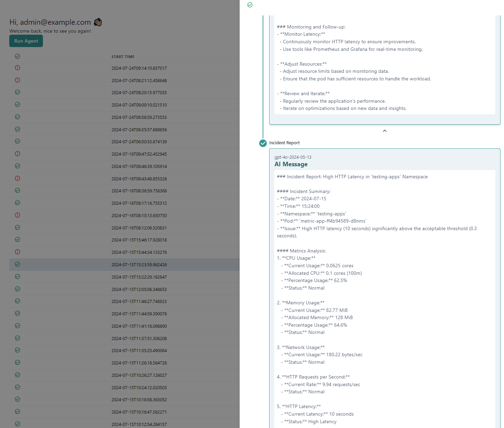
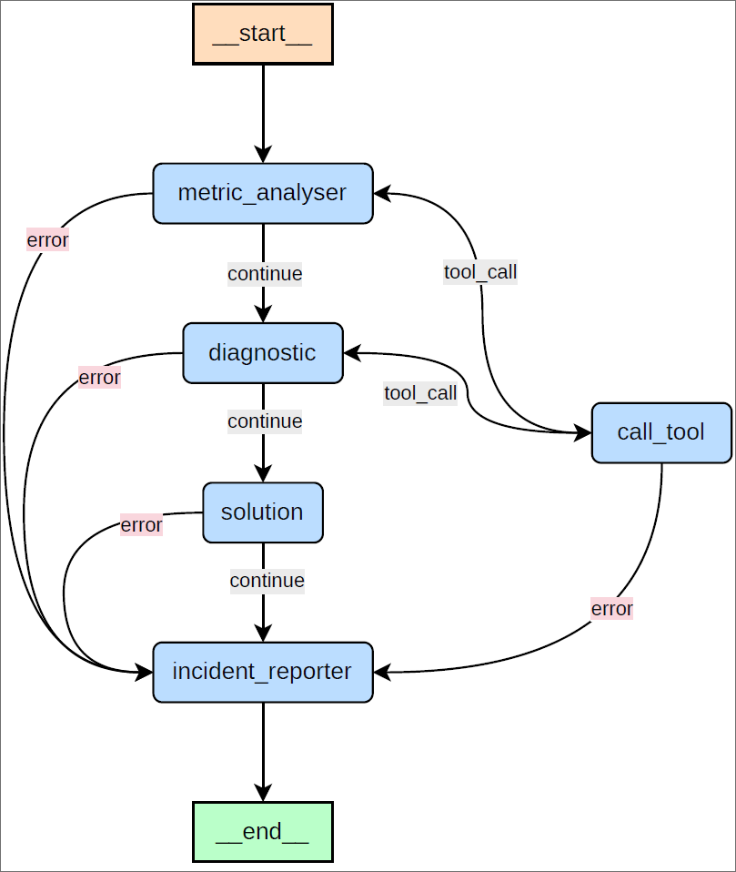

# Kubernetes LLM Agent

A large language model agent designed to monitor and resolve issues within a Kubernetes cluster efficiently. This agent assists system administrators by identifying the root cause of problems, allowing them to focus on more critical and engaging tasks. The agent not only provides solutions to the issues but also documents each step taken in an incident report, ensuring thorough problem resolution and traceability.

This project is the result of the Bachelor’s final project by Alen Bijelic during his final year at the School of Engineering and Management, Haute Ecole d'Ingénierie et de Gestion du Canton de Vaud (HEIG-VD). The project was supervised by Prof. Marcel Graf.

## Monitoring

The frontend provides a list of all agent runs, and each run can be viewed in detail.

The agent uses provided tools to retrieve information about the Kubernetes cluster and its resources. Here is an example of a run where the agent executes the `get_pod_names` to get pod names of a namespace.

## Agent workflow

The generated workflow can be seen in the following image.

The nodes represent the different steps the agent takes to resolve an issue, and the edges represent the dependencies between the steps. Some of the nodes are connected with the `call_tool` node, which represents the execution of a tool. 

If an error occurs during the execution of a step, the agent will stop the workflow and create an incident report. The incident report will contain the error message and the steps taken up to that point.

## Technology Stack
- [**Full Stack FastAPI Template**](https://github.com/tiangolo/full-stack-fastapi-template) for the backend, frontend and DB.
- [**LangGraph**](https://langchain-ai.github.io/langgraph/) and [**LangChain**](https://www.langchain.com/) for the AI agent.
- [**Google Kubernetes Engine**](https://cloud.google.com/kubernetes-engine) for the Kubernetes cluster.
- [**Prometheus**](https://prometheus.io/) for monitoring.
- [**Google Cloud Logging**](https://cloud.google.com/logging) to access deployed application logs.

## Documentation

- Technical documentation contains a part for the monitoring agent and a part of the Full Stack FastAPI documentation. They can be found in each of the following directories:
    * [Backend](backend/README.md) : contains the documentation for the backend part of the project including the monitoring agent.
    * [Frontend](frontend/README.md) : contains the documentation for the frontend part of the project.
- User documentation can be found in the [User documentation](USER_README.md) file.
- Administrator documentation can be found in the [Administrator documentation](ADMINISTRATOR_README.md) file.

## Backend Development

Backend docs: [backend/README.md](./backend/README.md).

## Frontend Development

Frontend docs: [frontend/README.md](./frontend/README.md).

## Deployment

Deployment docs: [deployment.md](./deployment.md).

## Development

General development docs: [development.md](./development.md).

This includes using Docker Compose, custom local domains, `.env` configurations, etc.

## Full stack FastAPI

For more information about the full stack FastAPI template project, go to [Full Stack FastAPI Template](https://github.com/tiangolo/full-stack-fastapi-template).

## License

The Kubernetes AI Agent is licensed under the terms of the MIT license.
