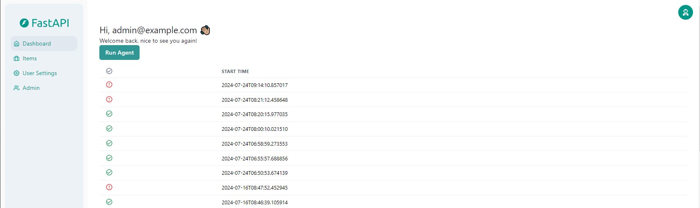
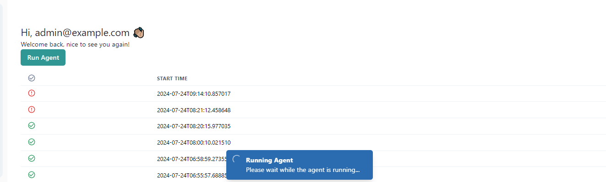

# Kubernetes AI Agent - User Documentation

## Introduction

The Kubernetes AI Agent is a tool that helps you monitor and manage your Kubernetes cluster. It uses AI reasoning to analyze the state of your cluster and provides suggestions on how to resolve issues.

This guide provides information on how to use the Kubernetes AI Agent interface.

## Pre-requisites

- Installed and having access to Kubernetes AI Agent

## Login

Connect to the Kubernetes AI Agent by opening the following URL in your browser:

```
http://localhost:8080
```

You will be presented with the login page. Enter your credentials or ask your administrator to create an account for you.


## Dashboard

After logging in, you will be presented with the dashboard. On the left side of the page, you can see all available menus.

A button in the top right corner allows you to log out.

The dashboard contains a list of all agent runs, and each run can be viewed in detail.



The button `Run Agent` allows you to start a new agent run. You will see a toast indicating that the agent run has started.



You can follow the progress of the agent run by clicking on the currently running agent execution. It will open a new page with the details of the run. In each step you can see the messages generated by the LLM agent. The agent can generate tool calls or AI messages. The tool calls are used to indicate that the agent is executing a tool to retrieve information about the Kubernetes cluster and its resources. You generally see the function name as well as used arguments. The AI messages are the result of the agent's AI reasoning process for each step. For each AI message and tool call, you can see the LLM version used.


When the run is finished, you can read the summary of the run or see the details of each step taken by the agent. You can then apply any of the suggested actions to resolve the issue.

