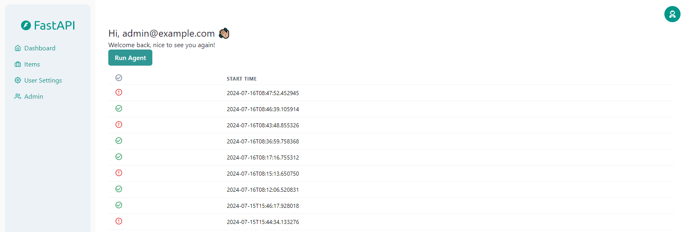
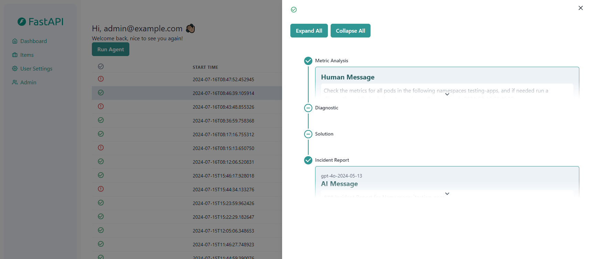
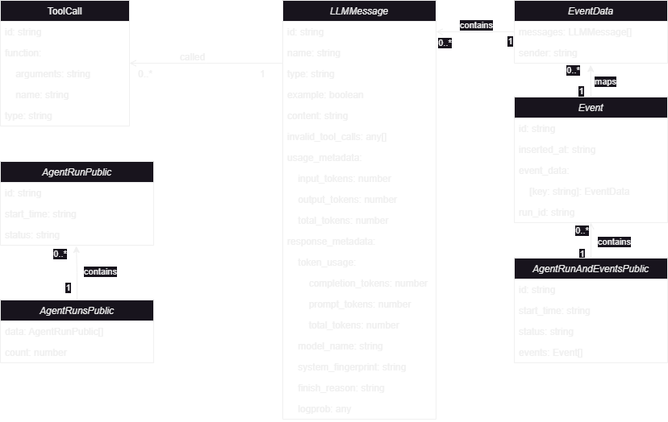

# Kubernetes AI Agent - Frontend

The Full Stack FastAPI frontend documentation can be found [down below](#fastapi-project---frontend)

## Code Structure

The frontend code is structured as follows:

* `frontend/.env` - The environment variables for the frontend.
* `frontend/src` - The main frontend code.
* `frontend/src/client` - The generated OpenAPI client.
* `frontend/src/components` -  The different components of the frontend.
* `frontend/src/hooks` - Custom hooks.
* `frontend/src/routes` - The different routes of the frontend which include the pages.
* `theme.tsx` - The Chakra UI custom theme.

## UI

The user interface is built with [Chakra UI](https://chakra-ui.com/). It is a simple and easy to use component library that provides a lot of components to build a modern and responsive UI.

The UI contains, in the main page a button to run the agent and a list of previous runs. When clicking on a run, a drawer will open with the details of the run.



The drawer contains a stepper with the different steps of the run. Each step contains the messages sent by the LLM and the tool calls made by the LLM. The messages are grouped by sender and displayed in the same step of the stepper. The buttons enables us to open and close all the steps of the stepper.



## WebSocket

A WebSocket connection is made to retrieve runs that are being executed in real-time.

The WebSocket connection is handled by the `WebsocketService` which contains the method `getWebSocket()`. This method returns a WebSocket instance that can be used to send and receive messages. It use the address specified in the `.env`file. The WebSocket connection is created when the index page is loaded using a `useEffect` hook.

The WebSocket instance is then managed in the `index.tsx` file using a ref. This allows to keep the connection open during the whole lifecycle of the application.

When a message is received from the WebSocket, it is parsed and added to the last run, only if the run is opened. If the user opens the run during its execution, the messages will first be loaded from the database, then the new messages will be displayed in real-time.

If an issue occurs with the WebSocket connection, an error message will be displayed to the user using toasts.

## Routes

The agent page is defined on the index page `frontend/src/routes/_layout/index.tsx`. It will display a button to run the agent and a list of previous runs. When clicking on an item of the list, it sets a query parameter `run` with the run id. This will open a [Drawer](https://v2.chakra-ui.com/docs/components/drawer) with the details of the run.

All requests are made through the Agent Service in the `frontend/src/client/servoces.ts` file. This service contains all the methods to interact with the backend API. The method `runAgent` is used to run the agent, `getAgentRuns` is used to get the list of runs and `getAgentRunById` is used to get the details of a run. 

### Models

Runs and events are defined in the `frontend/src/client/models.ts` file.

The interface `ToolCall` defines the structure of a tool call the LLM did. It contains the id, the functions used with its name and arguments and the type of the tool.

The interface `LLMMessage` defines the structure of a message sent by the LLM. It mocky the structure of the messages given by the LangChain abstract classes. It contains the id, the type of the message (AIMessage, HumanMessage or ToolMessage), the content and a list of tool calls.

The interface `EventData` defines the structure of an event. An event is a list of LLMMessage and a sender. The sender is one of the nodes of the LangGraph flow. It is used to group messages by sender and display them in the same step of the stepper.

The interface `Event` defines the structure of an event displayed in the drawer. It contains the id, the sender, the list of EventData and the date of the event.

The interface `AgentRunPublic` defines the structure of a run displayed in the list. It contains the id, the status, the start date and the status of the run. The interface `AgentRunAndEventsPublic` defines the structure of a run displayed in the drawer. It contains the id, the status, the start date, the status of the run and the list of events.

The interface `AgentRunsPublic` defines the complete list to display in the agent page. It contains the list of runs and a count of the total number of runs.



### Components

#### RunAgentButton

The `RunAgentButton` component is used to run the agent. It contains a button that will call the `runAgent` method of the Agent Service when clicked. Clicking the button will open a loading toast, that will be replaced by a success or error toast when the run is finished. Currently, the toast is not displayed when refreshing the page, if a run is being executed.

#### RunsTable

The `RunsTable` component is used to display the list of runs. It contains a table with the different runs. Each row of the table contains the status and the start date of the run. The status is displayed with an icon with a color depending on the status of the run.

#### RunAgentStepper

The `RunAgentStepper` component is used to display the messages sent by the LLM and the tool calls made by the LLM. It contains a stepper with the different steps of the run. Each step contains the group of messages at each step of the LLM execution. The messages are grouped by sender and displayed in the same step of the stepper. The buttons enables us to open and close all the steps of the stepper.

The run to display is passed as a prop to the component. The component will then display the messages and tool calls of the run.

#### Messages

The three components `AIMessage`, `HumanMessage` and `ToolMessage` are used to display the content of the messages. They contain a `Box` with a `Text` component to display the content of the message. The `AIMessage` component also contains a `Stack` with the different tool calls made by the LLM.

# FastAPI Project - Frontend

The frontend is built with [Vite](https://vitejs.dev/), [React](https://reactjs.org/), [TypeScript](https://www.typescriptlang.org/), [TanStack Query](https://tanstack.com/query), [TanStack Router](https://tanstack.com/router) and [Chakra UI](https://chakra-ui.com/).

## Frontend development

Before you begin, ensure that you have either the Node Version Manager (nvm) or Fast Node Manager (fnm) installed on your system. 

* To install fnm follow the [official fnm guide](https://github.com/Schniz/fnm#installation). If you prefer nvm, you can install it using the [official nvm guide](https://github.com/nvm-sh/nvm#installing-and-updating).

* After installing either nvm or fnm, proceed to the `frontend` directory:

```bash
cd frontend
```
* If the Node.js version specified in the `.nvmrc` file isn't installed on your system, you can install it using the appropriate command:

```bash
# If using fnm
fnm install

# If using nvm
nvm install
```

* Once the installation is complete, switch to the installed version:

```bash
# If using fnm
fnm use 

# If using nvm
nvm use
```

* Within the `frontend` directory, install the necessary NPM packages:

```bash
npm install
```

* And start the live server with the following `npm` script:

```bash
npm run dev
```

* Then open your browser at http://localhost:5173/.

Notice that this live server is not running inside Docker, it's for local development, and that is the recommended workflow. Once you are happy with your frontend, you can build the frontend Docker image and start it, to test it in a production-like environment. But building the image at every change will not be as productive as running the local development server with live reload.

Check the file `package.json` to see other available options.

### Removing the frontend

If you are developing an API-only app and want to remove the frontend, you can do it easily:

* Remove the `./frontend` directory.

* In the `docker-compose.yml` file, remove the whole service / section `frontend`.

* In the `docker-compose.override.yml` file, remove the whole service / section `frontend`.

Done, you have a frontend-less (api-only) app. 🤓

---

If you want, you can also remove the `FRONTEND` environment variables from:

* `.env`
* `./scripts/*.sh`

But it would be only to clean them up, leaving them won't really have any effect either way.

## Generate Client

* Start the Docker Compose stack.

* Download the OpenAPI JSON file from `http://localhost/api/v1/openapi.json` and copy it to a new file `openapi.json` at the root of the `frontend` directory.

* To simplify the names in the generated frontend client code, modify the `openapi.json` file by running the following script:

```bash
node modify-openapi-operationids.js
```

* To generate the frontend client, run:

```bash
npm run generate-client
```

* Commit the changes.

Notice that everytime the backend changes (changing the OpenAPI schema), you should follow these steps again to update the frontend client.

## Using a Remote API

If you want to use a remote API, you can set the environment variable `VITE_API_URL` to the URL of the remote API. For example, you can set it in the `frontend/.env` file:

```env
VITE_API_URL=https://my-remote-api.example.com
```

Then, when you run the frontend, it will use that URL as the base URL for the API.

## Code Structure

The frontend code is structured as follows:

* `frontend/src` - The main frontend code.
* `frontend/src/assets` - Static assets.
* `frontend/src/client` - The generated OpenAPI client.
* `frontend/src/components` -  The different components of the frontend.
* `frontend/src/hooks` - Custom hooks.
* `frontend/src/routes` - The different routes of the frontend which include the pages.
* `theme.tsx` - The Chakra UI custom theme.
